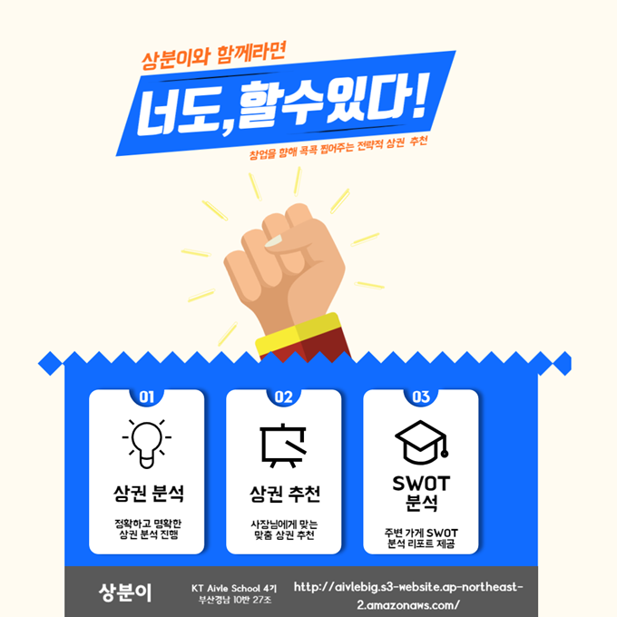
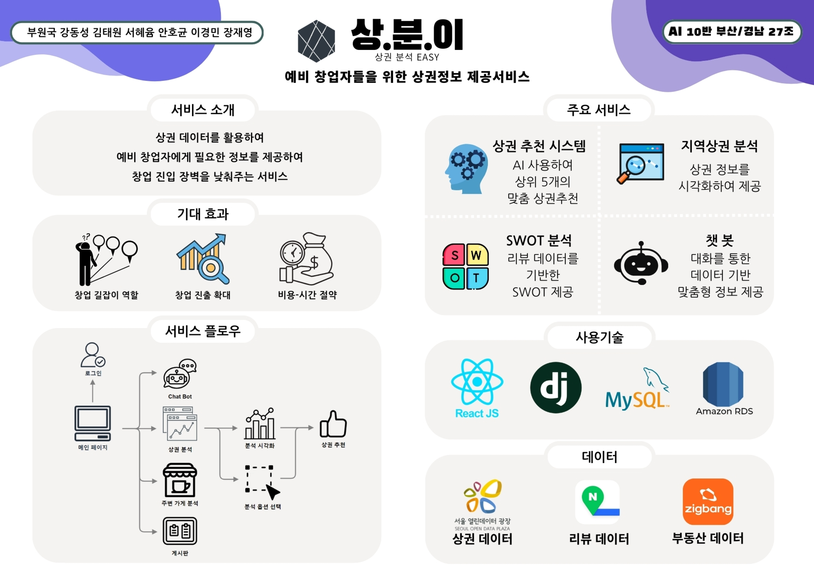
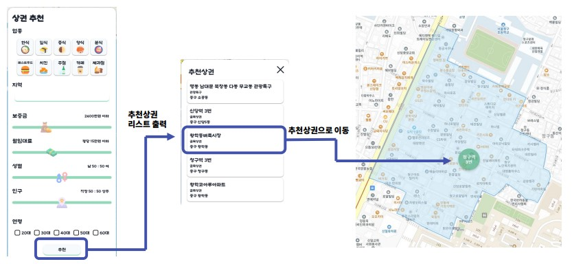
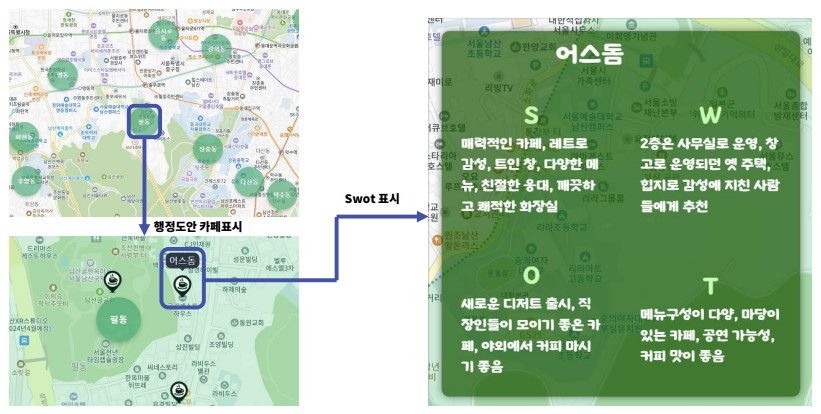
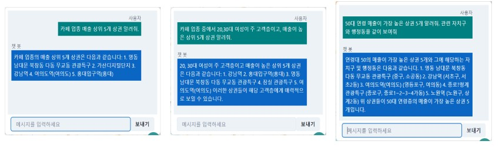

  

# 📊 상분이 (상권 분석 EASY)
사용자 맞춤형 상권지를 추천 및 실제 리뷰 데이터를 활용한 분석 서비스 🖥  
🚧 SITE LINK :  [sangbuni.com](http://sangbuni.com/)

## 🕺 팀원 소개

| 팀장 | 팀원 | 팀원 | 팀원 | 팀원 | 팀원 | 팀원 |
|:---:|:---:|:---:|:---:|:---:|:---:|:---:|
| [부원국](https://github.com/BOO-WONKUK) | [이경민](https://github.com/Lee-GyeongMin95) | [김태원](https://github.com/Taegooo) | [강동성](https://github.com/nobita123han) | [장재영](https://github.com/janjaeyoung) | [서혜윰](https://github.com/seo-hye-yum) | [안호균](https://github.com/VANDOL) |
| PM / AI | AI | AI | Front-End | Front-End | Back-End | Back-End |

## 👀 프로젝트 개요

-  📆 프로젝트 기간
   -  2023.12.11 ~ 2024.1.12 (5 week)

-  📌 기획 배경
   -  지역상권 분석의 중요성을 강조하며, 예비 창업자들에게 최적의 업종 선택을 위해 업종별 폐업률과 매출 정보 분석이 필요
   -  외식업체 창업자들은 상권 및 경쟁 분석이 어려워 폐업률이 높음
   -  창업 실패율을 줄이기 위해 보다 신중한 업종 선택과 성공적인 사업 운영을 지원하려는 목표

-  👓 메인 타겟
   -  상권 분석을 처음 하는 요식업 예비 창업자

-  💍 핵심 가치
   -  **개인화된 상권 및 창업 정보 제공**
      -  창업 준비 과정에서 위치 선정과 상권 분석이 중요한 요소임을 고려하여, 예비 창업자의 선호와 요구에 맞춘 맞춤형 상권 정보를 제공합니다. 이를 통해 정보 비대칭 문제를 해소하고, 창업자 개인의 상황에 적합한 의사 결정을 지원합니다.
   -  **종합적인 창업 지원**
      -  창업 준비에 필요한 모든 정보를 포괄적으로 제공하여 예비 창업자가 더 효율적으로 준비할 수 있도록 돕습니다. 상권 추천, 경쟁 분석, 실시간 상담을 통해 상권 관련 정보뿐 아니라 창업과 관련된 다양한 데이터를 종합적으로 제공합니다.

- 🗄 산출물
  - [🔖 발표 자료](docs/27조_발표자료.pdf) 
  - [📑 과제정의서](docs/27조_과제정의서.docx)
  - [📽 시연 영상 (10:13)](https://youtu.be/uRfOlUa_Oa8)
  - [📁 원본 및 가공 데이터](https://drive.google.com/drive/folders/14cVjtI_S7jvObnzVw91qSVikujq_Brq5?usp=sharing)

-  🥇 성과

   -  Collaboration상 수상
   -  우수 프로젝트 선정

 

## 💁‍♂️ 프로젝트 소개

 

**상분이 (상권 분석 EASY)** 는 요식업 예비 창업자를 위해 상권 분석을 쉽게 할 수 있도록 도와주는 `상권 분석 서비스` 입니다.
 
예비 창업자들이 상권 정보를 쉽게 이해하고 활용할 수 있도록 돕기 위해 개발되었습니다. 창업 과정에서 정보 비대칭으로 인해 많은 예비 창업자들이 겪는 어려움에 주목하여, 상권 분석 및 추천, SWOT 분석을 통해 창업 실패를 줄이고 준비 과정을 효율화하는 것을 목표로 삼고 있습니다.
 

 

## 💡 주요 기능

### 1️⃣ 상권 추천

> 서비스 내용 
> - 사용자 맞춤형 상권 추천 시스템을 통해, 예비 창업자가 자신의 조건에 적합한 상권을 탐색할 수 있도록 돕습니다. 사용자는 지역별 상권을 비교 분석하고, 적합한 창업 위치를 파악할 수 있습니다. 이를 통해 신뢰성 있는 위치 결정을 지원합니다.

> 사용 기술
> - K-means++: 거리 기반의 군집화 알고리즘으로 상권을 군집화하여 유사한 조건의 상권을 추천합니다.
 

### 2️⃣ SWOT 분석

> 서비스 내용
> - 서울시 내 모든 카페 리뷰 데이터를 바탕으로 강점, 약점, 기회, 위협을 파악해 요약한 SWOT 분석을 제공합니다. 예비 창업자는 이를 통해 경쟁 가게의 경쟁력 요소를 이해하고, 자신의 가게 전략을 계획할 수 있습니다.

> 사용 기술 
> -	리뷰 데이터 크롤링 및 전처리: 인터넷에서 수집된 리뷰 데이터를 가공해 활용할 수 있는 형태로 정제하며, Hyper CLOVA X의 요약 기능과 통합합니다.
> -	Hyper CLOVA X: 리뷰 데이터에서 가게의 SWOT 요약 정보를 생성해 신속하고 정확하게 정보 전달을 제공합니다.

 

### 3️⃣ ChatBot 기능

> 서비스 내용
> - 사용자의 창업 관련 질문에 상권 분석 데이터와 창업 정보를 실시간으로 제공하는 챗봇 시스템입니다. 사용자는 채팅을 통해 손쉽게 상권 추천 및 경쟁 분석 정보를 얻을 수 있습니다.

> 사용 기술 
> -	ChatGPT Assistants API : 상권 데이터, 리뷰 데이터, 부동산 데이터 등 수집된 데이터에 기반한 답변을 합니다.
> -	Prompt Engineering : 사용자의 질문에 대한 유연한 답변을 합니다.

 

- 👨‍🎨 **Front-End**
  - Language
    -     
  - Framework / Library
    - 

  - Design
    - 

- 🧑‍💻 **Back-End**
  - Language
    - 
  - Server
    - 
  - Data
    - 
  - open API
    - 

  - Delivery
    - 

- 👨‍👩‍👦 **Common**
  - Co-work
    -   

**Fin.**  
**Fin.**
